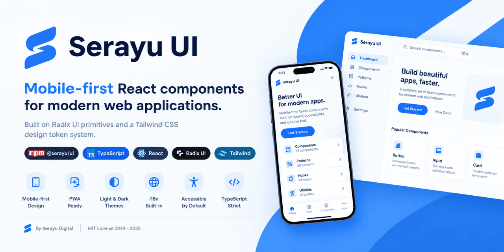

# Serayu UI

Mobile-first React components for web applications, built on Radix UI primitives and a Tailwind CSS design token system.

By [Serayu Digital](https://www.serayudigital.com). Package `@serayu/ui` on npm.

[](https://www.npmjs.com/package/@serayu/ui)
[](https://www.typescriptlang.org/)
[](https://reactjs.org/)
[](https://www.radix-ui.com/)
[](https://tailwindcss.com/)
[](https://web.dev/progressive-web-apps/)
[](https://github.com/serayudigital/serayu-ui/blob/main/LICENSE)


OVERVIEW

Serayu UI is a React component library that helps teams ship mobile-first applications with a native feel. It is built on Radix UI for accessibility and interactive behavior, styled with Tailwind CSS, and uses design tokens prefixed with `sd-` so consumers can override anything via standard CSS variables.

FEATURES

- Mobile-first ergonomics. 44px tap targets, safe-area inset handling, and patterns for bottom navigation, sheets, and pull-to-refresh.
- PWA-ready. Manifest helpers, service worker scaffolding, theme color updates, install prompts, share buttons, and update notifications.
- Dual-theme. Light and dark themes via a `data-theme` attribute with `prefers-color-scheme` fallback.
- Built-in i18n. `LocaleProvider` with `id-ID` defaults and a translation key API.
- Accessible by default. Focus traps, keyboard navigation, and ARIA roles inherited from Radix UI primitives.
- Strict TypeScript. 100% strict mode with full type definitions exposed per file.
- Tree-shakable. Only the imports you use are bundled.
- Solid color palette. WCAG AA contrast ratios throughout.
- 52 UI components, 29 patterns, 10 hooks, 21 utilities.


INSTALLATION

```bash
npm install @serayu/ui
npm install react@^18.3 react-dom@^18.3
```

Import the bundled stylesheet from your application entry point:

```tsx
// main.tsx
import "@serayu/ui/styles.css";
```

Importable paths exposed through the `exports` field:

| Path | Purpose |
| ---- | ------- |
| `@serayu/ui` | Public barrel - all components, hooks, and utilities |
| `@serayu/ui/styles.css` | Tailwind-compiled CSS exposing the `--sd-*` tokens |
| `@serayu/ui/components/ui/button` | Deep import when manual bundle control is required |
| `@serayu/ui/components/patterns/tour` | Deep import for a single pattern |
| `@serayu/ui/hooks/use-theme` | Deep import for a single hook |

Type definitions are resolved automatically through `exports.types`. No additional TypeScript configuration is required.


QUICK START

```tsx
import {
  Button,
  Card,
  CardContent,
  CardHeader,
  CardTitle,
  useToast,
} from "@serayu/ui";

function Example() {
  const { toast } = useToast();
  return (
    <Card>
      <CardHeader>
        <CardTitle>Hello, Serayu UI</CardTitle>
      </CardHeader>
      <CardContent>
        <Button onClick={() => toast({ title: "Saved", variant: "success" })}>
          Click me
        </Button>
      </CardContent>
    </Card>
  );
}
```


THEMING

Serayu UI supports two operating modes. The default is system mode, which follows `prefers-color-scheme`. The alternative is manual mode, controlled via `data-theme="light"` or `data-theme="dark"` on the document element.

User preferences persist in `localStorage` under the `sd-theme` key and synchronize across tabs through the browser `storage` event.

To prevent a Flash of Wrong Theme (FOWT), place the following inline script in the document `<head>` before React mounts:

```html
<script>
  (function () {
    try {
      var pref = localStorage.getItem("sd-theme") || "system";
      var resolved =
        pref === "system" || !pref
          ? window.matchMedia("(prefers-color-scheme: dark)").matches
            ? "dark"
            : "light"
          : pref;
      document.documentElement.setAttribute("data-theme", resolved);
    } catch (e) {}
  })();
</script>
```

Programmatic control is available through the `useTheme` hook:

```tsx
import { useTheme } from "@serayu/ui";

function Header() {
  const { preference, setPreference, toggle } = useTheme();
  return <button onClick={toggle}>Current theme: {preference}</button>;
}
```


INTERNATIONALIZATION

`LocaleProvider` makes number, currency, date, and translation formatting reactive to the active locale. The default locale is `id-ID`. The provider is additive and does not break existing formatters.

```tsx
import {
  LocaleProvider,
  useLocaleFormatters,
  useT,
} from "@serayu/ui";

const translations = {
  "id-ID": { hello: "Halo" },
  "en-US": { hello: "Hello" },
};

function App() {
  return (
    <LocaleProvider locale="id-ID" translations={translations}>
      <Greeting />
    </LocaleProvider>
  );
}

function Greeting() {
  const { formatCurrency } = useLocaleFormatters();
  const t = useT();
  return (
    <p>
      {t("hello", "Halo")}, total: {formatCurrency(1500000)}
    </p>
  );
}
```

The formatters `formatNumber`, `formatCurrency`, `formatDate`, and `formatRelative` automatically follow the active locale without requiring manual `Intl` calls. The `useLocale` hook returns the full context, including `locale`, `setLocale`, `t`, and the formatter functions.


PROGRESSIVE WEB APPS

A minimal manifest for PWA integration:

```json
{
  "name": "Serayu App",
  "short_name": "Serayu",
  "start_url": "/",
  "display": "standalone",
  "background_color": "#ffffff",
  "theme_color": "#0064f0",
  "icons": [
    { "src": "/icons/icon-192.png", "sizes": "192x192", "type": "image/png" },
    { "src": "/icons/icon-512.png", "sizes": "512x512", "type": "image/png" },
    {
      "src": "/icons/icon-maskable-512.png",
      "sizes": "512x512",
      "type": "image/png",
      "purpose": "maskable"
    }
  ]
}
```

The `<meta name="theme-color">` tag in the document head automatically swaps based on the resolved theme, following `prefers-color-scheme` through a media query.

PWA components shipped:

- `<InstallPrompt />` - install button that listens for `beforeinstallprompt`.
- `<NetworkStatus />` - live online/offline status badge.
- `<OfflineIndicator />` - banner that appears automatically when the device is offline.
- `<ShareButton />` - native sharing via `navigator.share` with a clipboard fallback.
- `<UpdateAvailableToast />` - notification when a new service worker version is available.


DESIGN TOKENS

All design tokens use the `sd-` prefix to avoid collisions with other libraries:

```css
--sd-background: #ffffff;
--sd-foreground: #0a0a0a;
--sd-brand: #0064f0;
--sd-radius-lg: 16px;
--sd-shadow-md: 0 2px 8px 0 rgba(0, 0, 0, 0.08);
--sd-duration-standard: 200ms;
```

Override tokens in your application:

```css
:root {
  --sd-brand: #ff5722;        /* replace brand with orange */
  --sd-radius-lg: 24px;       /* increase corner radius */
}
```

The bundled Tailwind configuration exposes each token as a utility class without the prefix:

```html
<button class="bg-brand text-brand-foreground rounded-lg">Button</button>
```


COMPONENTS (52)

| Category | Components |
| -------- | ---------- |
| Actions | `Button`, `Badge` |
| Layout | `Card`, `Separator`, `Skeleton`, `SkeletonGroup` |
| Feedback | `Alert`, `Toast`, `Toaster` |
| Forms (basic) | `Input`, `Textarea`, `Checkbox`, `Switch`, `RadioGroup`, `Select`, `Label` |
| Forms (advanced) | `Chip`, `SegmentedControl`, `Slider`, `Rating`, `Stepper`, `Combobox`, `Form`, `DatePicker`, `DateRangePicker`, `TimePicker`, `MultiSelectCombobox`, `ColorPicker` |
| Navigation | `Tabs`, `Accordion` |
| Overlays | `Dialog`, `AlertDialog`, `Sheet`, `Popover`, `DropdownMenu`, `Tooltip` |
| Data | `Avatar`, `AvatarGroup`, `AnimatedNumber`, `VirtualList`, `PhotoViewer`, `Carousel` |
| Charts | `Sparkline`, `ProgressRing`, `Donut`, `BarChart`, `LineChart`, `Heatmap` |
| PWA | `InstallPrompt`, `NetworkStatus`, `OfflineIndicator`, `ShareButton`, `UpdateAvailableToast` |
| i18n | `LocaleProvider` |
| Interaction | `SwipeableRow` |
| Theme | `ThemeToggle`, `ThemeCustomizer` |

Mobile-first patterns (29):

- `MobileHeader` - sticky header with three slots (back, title, action).
- `BottomNav` - bottom tab bar with three to five items.
- `MobileNav` - left or right drawer with grouped sections.
- `MobileSearch` - search bar with optional clear and voice buttons.
- `FilterBar` - horizontally scrollable chip row with snap.
- `FilterSheet` - sheet with Apply and Reset footer actions.
- `BottomSheet` - sheet with small, medium, and full snap points.
- `DataTable` - mobile cards below the `md` breakpoint, table layout above.
- `EmptyState` - icon, title, description, and CTA.
- `LoadingState` - spinner with label and `role="status"`.
- `Onboarding` - first-launch carousel with skip and progress dots.
- `ProfileHeader` - avatar, cover, stats, and follow/message CTAs.
- `SettingsList` - settings list with switches, links, and destructive actions.
- `SearchResults` - search results with filter slot and empty state.
- `ChatBubble` - incoming and outgoing bubbles with read receipts.
- `MediaGrid` - two, three, or four column grid with tap-to-lightbox.
- `SwipeActions` - swipe row to reveal actions (wraps `SwipeableRow`).
- `PullToRefresh` - pull-down refresh inside a scrollable container.
- `OTPInput` - N-digit OTP input with auto-advance and paste support.
- `CommandPalette` - global search dialog bound to Cmd/Ctrl+K.
- `NotificationPermission` - button for requesting the Notification API.
- `AuthLoginScreen` - email/password form with social buttons and remember-me.
- `AuthOTPForm` - four or six digit OTP form with auto-advance and resend countdown.
- `AuthBiometricPrompt` - WebAuthn biometric prompt with a passcode fallback.
- `StoryReelsViewer` - Instagram-style vertical pager with auto-advance and tap zones.
- `MapPreview` - OSM three-by-three tile preview with a pin overlay.
- `CommandBarMobile` - iOS share-sheet style command bar.
- `ThemeCustomizer` - live preview panel for tweaking `sd-*` tokens across four presets.
- `Tour` - guided product tour with spotlight and auto-positioned bubble.


HOOKS (10)

- `useTheme` - theme preference with cross-tab synchronization.
- `useMediaQuery` - media query hook with `useIsMobile`, `useIsDesktop`, and breakpoint helpers.
- `useToast` - global toast queue.
- `useDebounce` - debounce a value with a delay in milliseconds.
- `useLocalStorage` - state synchronized with `localStorage`.
- `useClickOutside` - trigger a callback when a click lands outside a target element.
- `useKeyboardShortcuts` - register global keyboard shortcuts.
- `useIntersectionObserver` - lazy trigger when an element enters the viewport.
- `useScrollLock` - lock body scroll while an overlay is active (`Dialog`, `Sheet`, `Tour`).
- `useVisibilityPause` - pause and resume via the Page Visibility API, useful for autoplay.


UTILITIES (21)

- `cn(...)` - combines `clsx` and `tailwind-merge`.
- Formatters: `formatCurrency`, `formatRupiah`, `formatNumber`, `formatDate`, `formatTanggal`, `formatRelative`, `formatNomorHP`, `formatPhoneNumber`.
- Validators: `isValidEmail`, `isValidIndonesianPhone`, `isValidNIK`.
- Theme helpers: `theme-overrides` exposing `ThemeOverrides`, `OVERRIDE_TO_VAR`, and `overridesToInlineStyle`, plus `theme-presets` exposing `THEME_PRESETS`, `DEFAULT_THEME`, `applyDocumentOverrides`, and `clearDocumentOverrides`.
- Calendar helpers: `calendar-utils` exposing `startOfMonth`, `addMonths`, `isSameDay`, `isSameMonth`, `getDayOfWeekMonFirst`, `stripTime`, `sortRange`, `isInRange`, `MONTH_NAMES_ID`, `MONTH_NAMES_EN`, `DAY_NAMES_ID`, `DAY_NAMES_EN_MON_FIRST`, and `pickLocale`.
- Generic helpers: `sleep`, `isClient`, `composeEventHandlers`, `mergeRefs`, `truncate`, `capitalize`, `clamp`, `uid`, `noop`.


SCRIPTS

| Command | Purpose |
| ------- | ------- |
| `npm run dev` | Start the Vite dev server with HMR. |
| `npm run build` | Type-check and produce a production build of the playground into `dist/`. |
| `npm run build:lib` | Library-mode build for publishing to npm (ESM, CJS, types, and CSS). |
| `npm run preview` | Serve the built `dist/` locally. |
| `npm run typecheck` | TypeScript no-emit check. |
| `npm run lint` | Run ESLint through the `eslint-plugin-serayu` plugin (four convention rules). |
| `npm run lint:serayu` | Run unit tests for the plugin (32 tests via `RuleTester`). |
| `npm run test` | Run the full Vitest suite (131 tests). |
| `npm run generate:icons` | Regenerate PWA icons from `favicon.ico`. |

The maintainer publishing workflow is documented in [docs/publishing.md](https://github.com/serayudigital/serayu-ui/blob/main/docs/publishing.md).


BROWSER SUPPORT

- Chrome and Edge 90 or later.
- Firefox 90 or later.
- Safari 15 or later (iOS 15 or later).
- Opera 76 or later.

Modern features in use: `prefers-color-scheme`, `prefers-reduced-motion`, `env(safe-area-inset-*)`, CSS variables, `:focus-visible`, and container queries for selected patterns.


DOCUMENTATION

The full documentation set is available in the [`docs/`](https://github.com/serayudigital/serayu-ui/tree/main/docs) folder:

- [Installation](https://github.com/serayudigital/serayu-ui/blob/main/docs/installation.md)
- [Theming (dark mode)](https://github.com/serayudigital/serayu-ui/blob/main/docs/theming.md)
- [Design Tokens](https://github.com/serayudigital/serayu-ui/blob/main/docs/tokens.md)
- [UI Components](https://github.com/serayudigital/serayu-ui/blob/main/docs/components.md)
- [Patterns](https://github.com/serayudigital/serayu-ui/blob/main/docs/patterns.md)
- [PWA](https://github.com/serayudigital/serayu-ui/blob/main/docs/pwa.md)
- [Publishing to npm](https://github.com/serayudigital/serayu-ui/blob/main/docs/publishing.md) (maintainer guide)
- [Contributing](https://github.com/serayudigital/serayu-ui/blob/main/docs/contributing.md)


LICENSE

MIT (c) [Serayu Digital](https://www.serayudigital.com).

Contributions, issues, and pull requests are welcome.


<p align="center">
  <sub>
    Serayu UI by <a href="https://www.serayudigital.com">Serayu Digital</a>.
  </sub>
</p>
